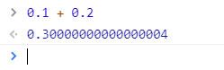

# Trading Signals

    

Technical indicators and overlays to run technical analysis with JavaScript / TypeScript.

## Motivation

The "trading-signals" library provides a TypeScript implementation for common technical indicators with arbitrary-precision decimal arithmetic.

The main focus of this library is on the accuracy of calculations, but using the [faster implementations](./README.md#faster-implementations) it is also suitable for calculations where performance is important.

## Features

- **Accurate.** Don't rely on type `number` and its precision limits. Use [Big][1].
- **Typed.** Source code is 100% TypeScript. No need to install external typings.
- **Tested.** Code coverage is 100%. No surprises when using it.

## Technical Indicator Types

- Trend indicators: Measure the direction of a trend
- Volume indicators: Measure the strength of a trend (based on volume)
- Volatility indicators: Measure the strength of a trend (based on price)
- Momentum indicators: Measure the speed of price movement

## Supported Technical Indicators

1. Acceleration Bands (ABANDS)
1. Accelerator Oscillator (AC)
1. Average Directional Index (ADX)
1. Average True Range (ATR)
1. Awesome Oscillator (AO)
1. Bollinger Bands (BBANDS)
1. Center of Gravity (CG)
1. Double Exponential Moving Average (DEMA)
1. Dual Moving Average (DMA)
1. Exponential Moving Average (EMA)
1. Momentum (MOM)
1. Moving Average Convergence Divergence (MACD)
1. Rate-of-Change (ROC)
1. Relative Strength Index (RSI)
1. Simple Moving Average (SMA)
1. Smoothed Moving Average (SMMA)
1. Stochastic Oscillator (STOCH)
1. Wilder's Smoothed Moving Average (WSMA)

Utility Methods:

1. Average
1. Standard Deviation
1. Rolling Standard Deviation

## Usage

```typescript
import {SMA} from 'trading-signals';

const sma = new SMA(3);

// You can add numbers:
sma.update(40);
sma.update(30);
sma.update(20);

// You can add strings:
sma.update('10');

// You can add arbitrary-precision decimals:
import Big from 'big.js';
sma.update(new Big(30));

// You can get the result in various formats:
console.log(sma.getResult().valueOf()); // "20"
console.log(sma.getResult().toFixed(2)); // "20.00"
```

### When to use `update(...)`?

You have to call an indicator's `update` method to enter input data. The update method may or may not return a result from the indicator depending on whether the minimum amount of input data has been reached.

### When to use `getResult()`?

You can call `getResult()` at any point in time, but it throws errors unless an indicator has received the minimum amount of data. If you call `getResult()`, before an indicator has received the required amount of input values, a `NotEnoughDataError` will be thrown.

**Example:**

```ts
import {SMA} from 'trading-signals';

// Our interval is 3, so we need 3 input values
const sma = new SMA(3);

// We supply 2 input values
sma.update(10);
sma.update(40);

try {
  // We will get an error, because the minimum amount of inputs is 3
  sma.getResult();
} catch (error) {
  console.log(error.constructor.name); // "NotEnoughDataError"
}

// We will supply the 3rd input value
sma.update(70);

// Now, we will receive a proper result
console.log(sma.getResult().valueOf()); // "40"
```

Most of the time, the minimum amount of data depends on the interval / time period used.

## Performance

### Arbitrary-precision decimal arithmetic

JavaScript is very bad with numbers. When calculating `0.1 + 0.2` it shows you `0.30000000000000004`, but the truth is `0.3`.



As specified by the ECMAScript standard, all arithmetic in JavaScript uses [double-precision floating-point arithmetic](https://en.wikipedia.org/wiki/Double-precision_floating-point_format), which is only accurate until certain extent. To increase the accuracy and avoid miscalculations, the [trading-signals](https://github.com/bennycode/trading-signals) library uses [big.js][1] which offers arbitrary-precision decimal arithmetic. However, this arbitrary accuracy comes with a downside: Calculations with it are not as performant as with the primitive data type `number`.

### Faster implementations

To get the best of both worlds (high accuracy & high performance), you will find two implementations of each indicator (e.g. `SMA` & `FasterSMA`). The standard implementation uses big.js and the `Faster`-prefixed version uses common `number` types. Use the standard one when you need high accuracy and use the `Faster`-one when you need high performance.

### Benchmarks

You can run `yarn start:benchmark` to see the runtime performance of each technical indicator on your machine. This will give you an understanding of which indicators can be calculated faster than others.

## Disclaimer

The information and publications of [trading-signals](https://github.com/bennycode/trading-signals) do not constitute financial advice, investment advice, trading advice or any other form of advice. All results from [trading-signals](https://github.com/bennycode/trading-signals) are intended for information purposes only.

It is very important to do your own analysis before making any investment based on your own personal circumstances. If you need financial advice or further advice in general, it is recommended that you identify a relevantly qualified individual in your jurisdiction who can advise you accordingly.

## Alternatives

- [Tulip Indicators (ANSI C)](https://github.com/TulipCharts/tulipindicators)
- [Pandas TA (Python)](https://github.com/twopirllc/pandas-ta)
- [Jesse Trading Bot Indicators (Python)](https://docs.jesse.trade/docs/indicators/reference.html)
- [libindicators (C#)](https://github.com/mgfx/libindicators)
- [Cloud9Trader Indicators (JavaScript)](https://github.com/Cloud9Trader/TechnicalIndicators)
- [Crypto Trading Hub Indicators (TypeScript)](https://github.com/anandanand84/technicalindicators)
- [Technical Analysis Library using Pandas and Numpy (Python)](https://github.com/bukosabino/ta)

## Maintainers

[![Benny Neugebauer on Stack Exchange][stack_exchange_bennycode_badge]][stack_exchange_bennycode_url]

## Contributing

Contributions, issues and feature requests are welcome!

Feel free to check the [issues page](https://github.com/bennycode/trading-signals/issues).

## License

This project is [MIT](./LICENSE) licensed.

## ⭐️ Show your support ⭐️

[Please leave a star](https://github.com/bennycode/trading-signals/stargazers) if you find this project useful.

If you like this project, you might also like these related projects:

- [**coinbase-pro-node**](https://github.com/bennycode/coinbase-pro-node), Actively maintained Coinbase Pro API written in TypeScript.
- [**ig-trading-api**](https://github.com/bennycode/ig-trading-api), IG CFD Trading API written in TypeScript.
- [**binance-api-node**](https://github.com/Ashlar/binance-api-node), Heavily tested and Promise-based Binance API with TypeScript definitions.

[1]: http://mikemcl.github.io/big.js/
[stack_exchange_bennycode_badge]: https://stackexchange.com/users/flair/203782.png?theme=default
[stack_exchange_bennycode_url]: https://stackexchange.com/users/203782/benny-neugebauer?tab=accounts
