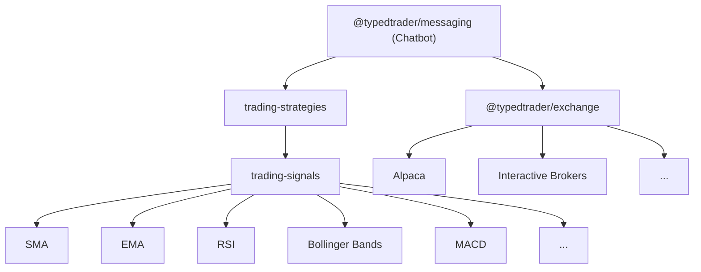

# Trading Signals Monorepo

**A fully-typed, modular toolkit for building algorithmic trading bots in TypeScript — from technical indicators up to a Telegram-controlled live bot.**

This monorepo is home to the popular [`trading-signals`](https://www.npmjs.com/package/trading-signals) library (tested in production and trusted by [hundreds of projects](https://github.com/bennycode/trading-signals/network/dependents) worldwide) along with everything you need to turn those signals into a running trading bot: strategies, an exchange abstraction, and a chatbot front-end.

Every piece is independently usable. Pick a package, drop it into your app, or run the whole stack and command your bot from your phone.

## Highlights

- **Streaming-first indicators** — SMA, EMA, RSI, MACD, Bollinger Bands, and many more, with replace-mode and lazy evaluation for backtests and live use.
- **Composable strategies** — a tiny `Strategy` interface (return an `OrderAdvice` per candle) lets you focus on signal logic while the framework owns session state, order placement, fills, and broker quirks. Ships with ready-to-use building blocks and a `ProtectedStrategy` base that adds self-cleaning stop-loss / take-profit kill switches.
- **Broker-agnostic execution** — a unified exchange interface with type-safe schemas (Zod), WebSocket streaming, and paper-trading support. Ships with [Alpaca Trading](https://alpaca.markets/) out of the box but is designed for any additional broker or exchange to plug in.
- **Control your bot from Telegram** — add accounts, spin up strategies via conversational wizards, watch prices, schedule recurring reports, and inspect live strategy state and config, all from a chat.
- **Modern TypeScript stack** — Latest TypeScript version, ESM-native, Node LTS, Lerna-managed workspaces, Vitest-covered, drizzle-backed persistence.

## Quickstart

```bash
npm install

# Run the full test matrix across all packages
npm test

# Launch the indicator showcase (Next.js)
npm run start:docs

# Start the Telegram bot (requires TELEGRAM_BOT_TOKEN in your env)
npm run start:bot
```

## 📦 Packages

This project uses [Lerna](https://lerna.js.org/) to manage a [monorepo](https://monorepo.tools/) with independent versioning.

| Package | Description |
| --- | --- |
| [**trading-signals**](./packages/trading-signals) | [Technical indicators](https://en.wikipedia.org/wiki/Technical_indicator) (SMA, EMA, RSI, MACD, Bollinger Bands, ...) for algorithmic trading with streaming updates, replace mode, lazy evaluation, and memory efficiency. Battle-tested in production. |
| [**trading-strategies**](./packages/trading-strategies) | [Trading strategies](https://en.wikipedia.org/wiki/Trading_strategy) that combine indicators into actionable advice. Ships with a library of ready-to-use strategies and a `ProtectedStrategy` base that wires stop-loss and take-profit kill switches into any subclass. |
| [**@typedtrader/exchange**](./packages/exchange) | Unified exchange interface for different brokers (currently [Alpaca](https://alpaca.markets/)). Type-safe data transformation, WebSocket candles and order updates, paper- and live-trading environments behind a single API. |
| [**@typedtrader/messaging**](./packages/messaging) | Remote-control layer for your personal trading bot via [Telegram](https://core.telegram.org/bots). Add accounts, run strategies, watch prices, schedule reports, and inspect live strategy state — all from chat. Persistence via SQLite + Drizzle ORM. |
| [**trading-signals-docs**](./packages/trading-signals-docs) | [Interactive showcase website](https://bennycode.com/trading-signals/) built with Next.js. See every indicator in action before you code. |

## How it fits together

At the foundation, **trading-signals** provides technical indicators like SMA, EMA, RSI, and Bollinger Bands. **trading-strategies** builds on top of them to produce actionable trading advice and ships kill-switch protection out of the box. **@typedtrader/exchange** abstracts away broker differences so strategies can run against any supported exchange. Finally, **@typedtrader/messaging** ties it all together into a chatbot that lets you operate your bot remotely.


```mermaid
graph TD
    messaging["@typedtrader/messaging (Chatbot)"]

    messaging --> strategies["trading-strategies"]
    messaging --> exchange["@typedtrader/exchange"]

    strategies --> signals["trading-signals"]

    signals --> SMA
    signals --> EMA
    signals --> RSI
    signals --> BBANDS["Bollinger Bands"]
    signals --> MACD
    signals --> more["..."]

    exchange --> Alpaca
    exchange --> IB["Interactive Brokers"]
    exchange --> more-exchanges["..."]
```
