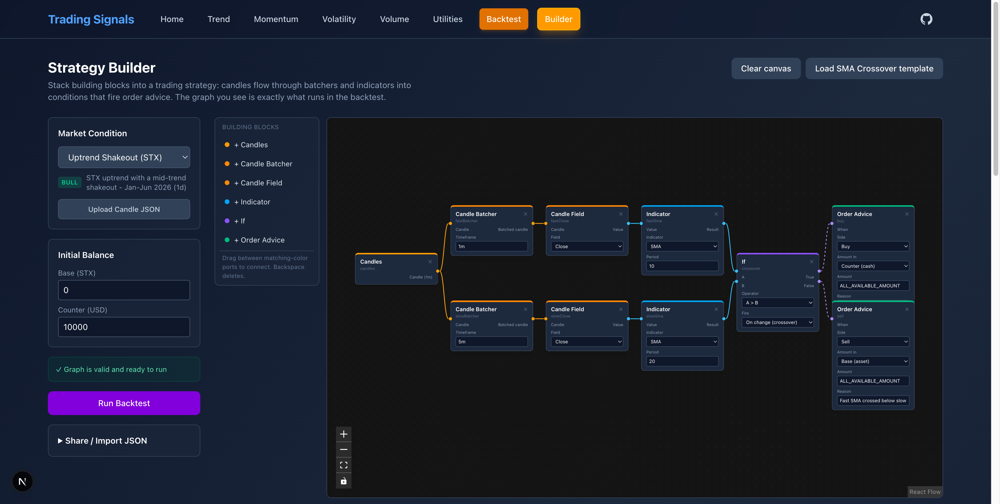
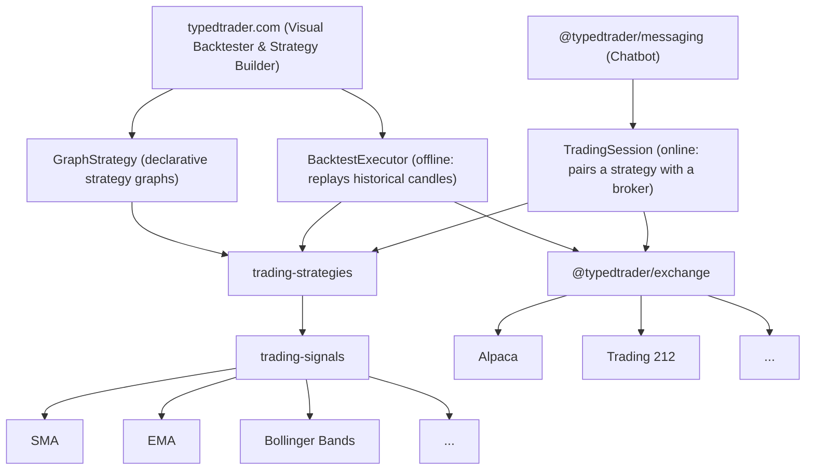

# Trading Signals Monorepo

**Build a trading strategy visually or in TypeScript, prove it in a backtest, and run it live — through the exact same code path.**

This monorepo is home to the popular [`trading-signals`](https://www.npmjs.com/package/trading-signals) library (tested in production and trusted by [hundreds of projects](https://github.com/bennycode/trading-signals/network/dependents) worldwide), grown into a complete algorithmic-trading framework: streaming indicators, composable strategies, a visual strategy builder, a broker-agnostic execution layer, and a Telegram-controlled live bot.

[](https://typedtrader.com/graph-builder/)

## From idea to live trading in three steps

### 1. Build it — with blocks or with code

Stack building blocks in the **[Visual Strategy Builder](https://typedtrader.com/graph-builder/)**: candles flow through batchers and indicators into conditions that fire order advice. Ports are typed, so incompatible blocks simply refuse to connect — and mixed timeframes are safe by construction, because a batcher only emits on bar close (no mid-bar peeking, no lookahead bias).

Prefer code? The same strategy is a few lines of TypeScript:

```ts
import {GraphStrategy, createSmaCrossoverGraph} from 'trading-strategies';

// The graph JSON from the visual builder is a first-class citizen…
const strategy = new GraphStrategy(createSmaCrossoverGraph({fastPeriod: 10, slowPeriod: 20, slowTimeframe: '5m'}));
```

```ts
import {Strategy} from 'trading-strategies';

// …and so is a hand-written class: return an OrderAdvice per candle, the framework owns the rest.
class MyStrategy extends Strategy {
  protected async processCandle(candle: OneMinuteBatchedCandle, state: TradingSessionState) {
    // your signal logic
  }
}
```

Both are extensible: register your own building blocks (news signals, on-chain data, custom math) with `registerNodeType()` and they appear in the visual builder automatically.

### 2. Prove it — backtests that mirror live trading

`BacktestExecutor` replays historical candles through the **same advice→order translation a live session uses** — fees, one-candle fill delays, balance tracking, order rounding. Strategy warm-up (`init`) runs in backtests too, fed only with data from before the test window, so a strategy can never peek at the candles it is about to be judged on.

Try it without installing anything at **[typedtrader.com/backtest](https://typedtrader.com/backtest/)** — interactive charts, trade markers, P&L stats, and a buy-and-hold baseline for every run.

### 3. Run it live — same strategy, real broker

The strategy object you backtested plugs unchanged into a `TradingSession` against a real broker (paper or live trading via [Alpaca](https://alpaca.markets/), with more brokers pluggable behind one interface). Operate it from Telegram: add accounts, spin up strategies through conversational wizards, watch prices, and inspect live state from your phone.

**The guarantee that ties it together:** there is no separate "backtest runtime" whose results could diverge from production. Graphs built in the visual builder are equivalence-tested against their hand-written counterparts — advice for advice, balance for balance.

## Highlights

- **Streaming-first indicators** — SMA, EMA, RSI, MACD, Bollinger Bands, and many more, with replace-mode and lazy evaluation for backtests and live use.
- **Composable strategies** — a tiny `Strategy` interface (return an `OrderAdvice` per candle) lets you focus on signal logic while the framework owns session state, order placement, fills, and broker quirks. Ships with ready-to-use building blocks and a `ProtectedStrategy` base that adds self-cleaning stop-loss / take-profit kill switches.
- **Visual strategy builder** — compose strategies from typed building blocks at **[typedtrader.com/graph-builder](https://typedtrader.com/graph-builder/)**, share them as JSON, and extend the palette with your own nodes via `registerNodeType()`.
- **Visual backtesting in your browser** — try any strategy against historical candles with interactive charts, trade markers, and P&L stats at **[typedtrader.com/backtest](https://typedtrader.com/backtest/)**. Tune parameters, see the results instantly, no setup required.
- **Broker-agnostic execution** — a unified exchange interface with type-safe schemas (Zod), WebSocket streaming, and paper-trading support. Ships with [Alpaca Trading](https://alpaca.markets/) out of the box but is designed for any additional broker or exchange to plug in.
- **Control your bot from Telegram** — add accounts, spin up strategies via conversational wizards, watch prices, schedule recurring reports, and inspect live strategy state and config, all from a chat.
- **Modern TypeScript stack** — Latest TypeScript version, ESM-native, Node LTS, Lerna-managed workspaces, Vitest-covered, drizzle-backed persistence.

## Quickstart

```bash
npm install

# Run the full test matrix across all packages
npm test

# Launch the indicator showcase, visual backtester & strategy builder (Next.js)
npm run start:docs

# Start the Telegram bot (requires TELEGRAM_BOT_TOKEN in your env)
npm run start:bot
```

## 📦 Packages

This project uses [Lerna](https://lerna.js.org/) to manage a [monorepo](https://monorepo.tools/) with independent versioning.

| Package | Description |
| --- | --- |
| [**trading-signals**](./packages/trading-signals) | [Technical indicators](https://en.wikipedia.org/wiki/Technical_indicator) (SMA, EMA, RSI, MACD, Bollinger Bands, ...) for algorithmic trading with streaming updates, replace mode, lazy evaluation, and memory efficiency. Battle-tested in production. |
| [**trading-strategies**](./packages/trading-strategies) | [Trading strategies](https://en.wikipedia.org/wiki/Trading_strategy) that combine indicators into actionable advice. Ships with a library of ready-to-use strategies, declarative strategy graphs (`GraphStrategy`) that power the visual builder, and a `ProtectedStrategy` base that wires stop-loss and take-profit kill switches into any subclass. |
| [**@typedtrader/exchange**](./packages/exchange) | Unified exchange interface for different brokers (currently [Alpaca](https://alpaca.markets/)). Type-safe data transformation, WebSocket candles and order updates, paper- and live-trading environments behind a single API. |
| [**@typedtrader/messaging**](./packages/messaging) | Remote-control layer for your personal trading bot via [Telegram](https://core.telegram.org/bots). Add accounts, run strategies, watch prices, schedule reports, and inspect live strategy state — all from chat. Persistence via SQLite + Drizzle ORM. |
| [**trading-signals-docs**](./packages/trading-signals-docs) | [Interactive showcase](https://typedtrader.com/) built with Next.js: explore every indicator in action, [backtest strategies](https://typedtrader.com/backtest/) against real historical candles, and [compose strategies visually](https://typedtrader.com/graph-builder/) from building blocks. |

## How it fits together

At the foundation, **trading-signals** provides technical indicators like SMA, EMA, RSI, and Bollinger Bands. **trading-strategies** builds on top of them to produce actionable trading advice — written as TypeScript classes or composed as declarative graphs in the visual builder — and ships kill-switch protection out of the box. **@typedtrader/exchange** abstracts away broker differences so strategies can run against any supported exchange. Finally, **@typedtrader/messaging** ties it all together into a chatbot that lets you operate your bot remotely.


```mermaid
graph TD
    messaging["@typedtrader/messaging (Chatbot)"]

    messaging --> session["TradingSession (online: pairs a strategy with a broker)"]
    website["typedtrader.com (Visual Backtester & Strategy Builder)"] --> backtest["BacktestExecutor (offline: replays historical candles)"]
    website --> graphs["GraphStrategy (declarative strategy graphs)"]

    session --> strategies["trading-strategies"]
    session --> exchange["@typedtrader/exchange"]
    backtest --> strategies
    backtest --> exchange
    graphs --> strategies

    strategies --> signals["trading-signals"]

    signals --> SMA
    signals --> EMA
    signals --> BBANDS["Bollinger Bands"]
    signals --> more["..."]

    exchange --> Alpaca
    exchange --> T212["Trading 212"]
    exchange --> more-exchanges["..."]
```
