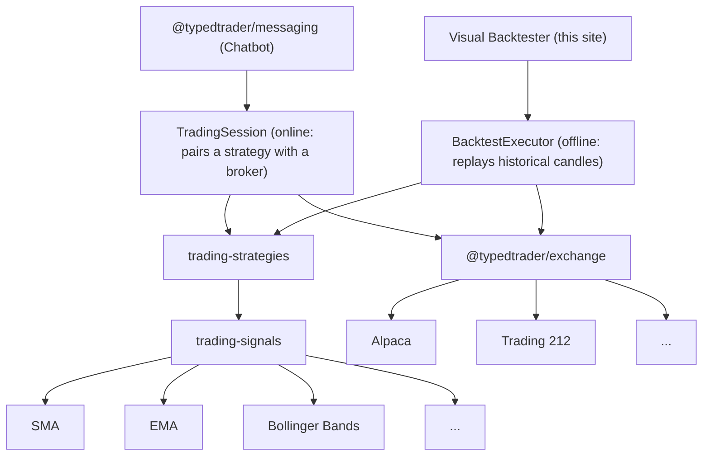

import {PackageGrid} from '../components/PackageGrid';

# Typed Trader

Typed Trader is a monorepo that gives you all the puzzle pieces for building a successful trading bot. You choose which pieces you need: just the strategies, just candle data for testing, or just the indicators to run technical analysis.

Every piece connects to the others, and every piece works in isolation. Use the famous [trading-signals](https://www.npmjs.com/package/trading-signals) library inside your own trading framework. Take only the [exchange package](https://www.npmjs.com/package/@typedtrader/exchange) to connect your own bot to brokers like Alpaca or Trading 212. Or grab the [candle datasets](https://github.com/bennycode/trading-signals/tree/main/packages/candles) to experiment with backtesting.

You can even build your very own strategy, based on indicators, news, or API calls to other sources, and run it with the [trading-strategies](https://www.npmjs.com/package/trading-strategies) package. It is compatible with the exchange layer, so the same strategy can also trade live. On top of it all, the [messaging package](https://github.com/bennycode/trading-signals/tree/main/packages/messaging) gives you a remote control: start your trading logic straight from Telegram.

And this documentation site is not just documentation. It offers full [backtesting capabilities](/backtest), too.

## The Building Blocks



## Take It Into Code

The site is a window into a set of open-source, fully-typed TypeScript packages. What you see in the demos is exactly what you get in code:

```bash
npm install trading-signals
```

```ts twoslash
import {SMA} from 'trading-signals';

const sma = new SMA(5);

sma.add(81);
sma.add(24);
sma.add(75);
sma.add(21);
sma.add(34);

console.log(sma.getResult()); // 47
```

<PackageGrid />

---

_Typed Trader is for research and education — nothing here is financial advice._
